# TFT дисплей на ESP32

Привіт! 👋 Це мій невеличкий, але інформативний тутор про підключення та використання **TFT дисплею** з мікроконтролером **ESP32**.  
Для роботи ми будемо використовувати бібліотеку **[TFT_eSPI](https://github.com/Bodmer/TFT_eSPI)**.  

Робота йде у **Visual Studio Code** з розширенням **PlatformIO**.

---

## 1. Чому саме TFT_eSPI?

Багато хто починає з бібліотек **Adafruit_ST7735** чи **Adafruit_ILI9341**. Вони прості у використанні та добре документовані, але:  
- вони написані під **конкретні чіпи дисплеїв** (ST7735 або ILI9341),  
- швидкість малювання обмежена — цього вистачає для тексту, але важко для графіків чи анімації.  

Натомість **TFT_eSPI** має переваги:  
✔ Підтримує десятки різних контролерів дисплеїв (ST7735, ST7789, ILI9341, ILI9488 та інші).  
✔ Дуже швидка — оптимізована під ESP32.  
✔ Має купу прикладів: від простого тексту до годинників, графіків і навіть ігор.  
✔ Гнучка — можна легко налаштувати піни, кольори, шрифти.  

Тому я вибрав саме **TFT_eSPI**.

---

## 2. Схема підключення

.png)
*Особиста розробка, виконана у графічному редакторі.*

---

## 3. Додавання бібліотеки у Visual Studio Code

У PlatformIO бібліотеки додаються через `platformio.ini` або через пошук у вкладці **Libraries**.  

Приклад у `platformio.ini`:  

```c++
[env:featheresp32]
platform = espressif32
board = featheresp32
framework = arduino

lib_deps =
    bodmer/TFT_eSPI @ ^2.5.43

monitor_speed = 115200
```
Приклад у вкладці **Libraries**:

*Крок 1*
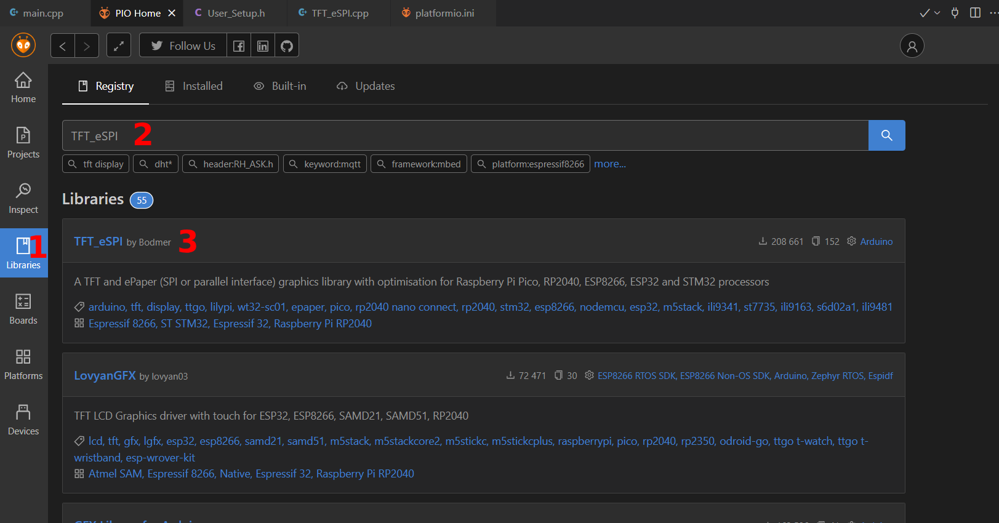

*Крок 2*
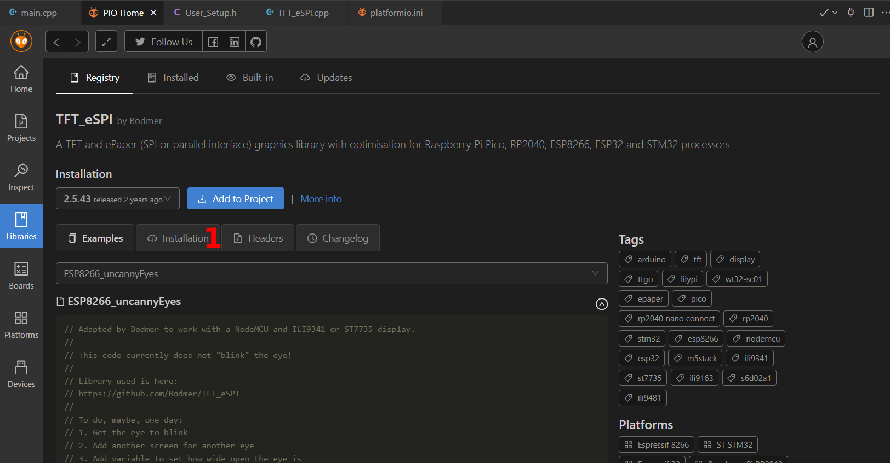

*Крок 3*
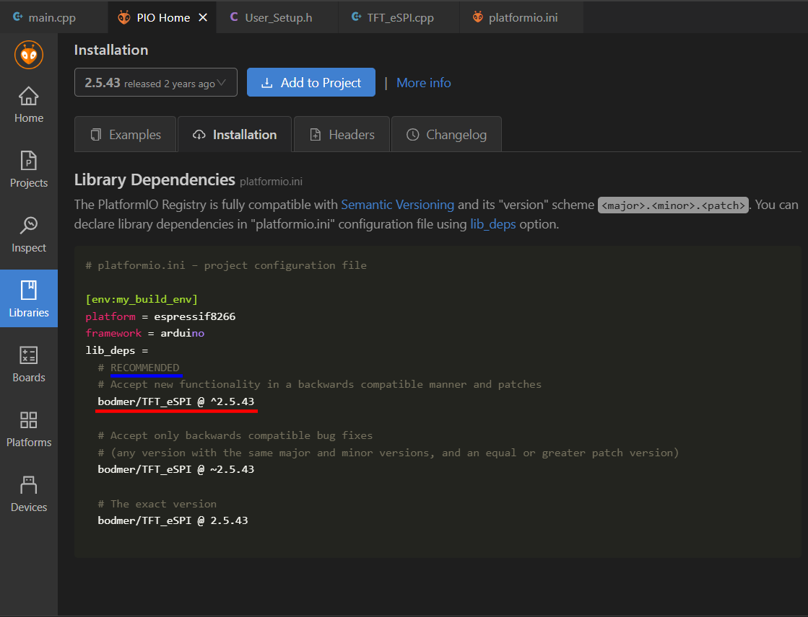

*Раджу обирати версію, рекомендовану розробником цієї бібліотеки.*
---

## 4. Налаштування пінів

У TFT_eSPI всі піни прописуються у файлі:
`.pio/libdeps/<project name>/TFT_eSPI/User_Setup.h`

**4.1 Шлях до папки з налаштуваннями пінів:**

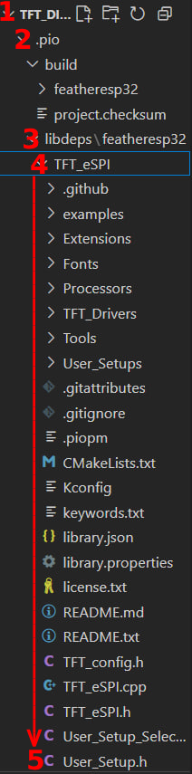

**4.2 Там вказуємо:**

*Крок 1 - Вибір драйверу дисплея*
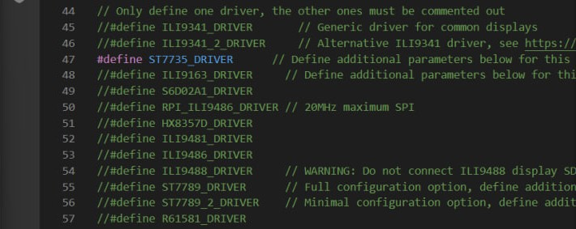

*Крок 2 - Вибір розміру екрану*
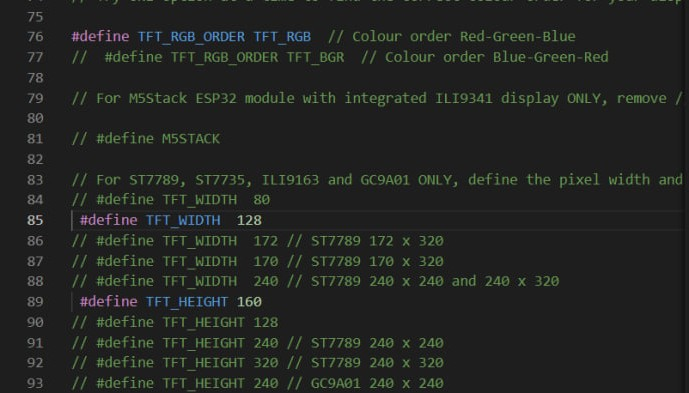

*Крок 3 - Тип підключення (варіант ST7735)*
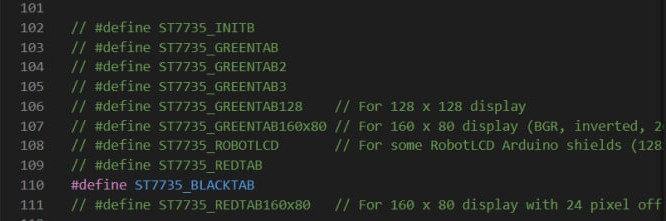

*Крок 4 - Призначення пінів для ESP32*
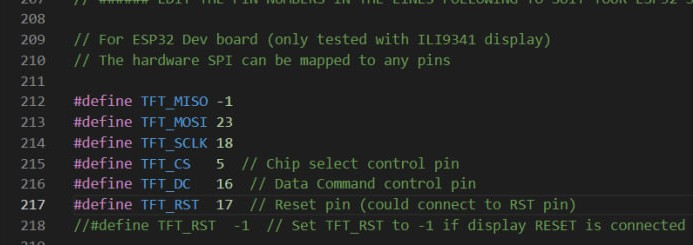

*Крок 5 - Налаштування шрифтів, які будуть у бібліотеці*
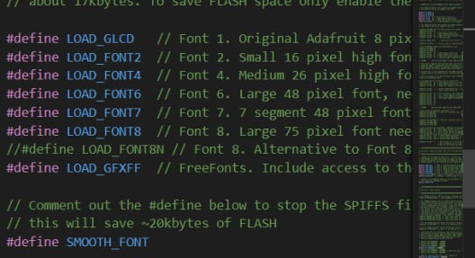

*Крок 6 - Частота SPI (залишаємо все як є)*
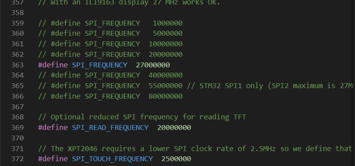

**Якщо ви підключили все згідно з моїми пінами, можете скопіювати й вставити мій код у папку. Я видалив зайві коментарі й залишив тільки необхідне для стабільної роботи. Але перед цим, будь ласка, уважно прочитайте весь файл.**

```c++
#define USER_SETUP_INFO "User_Setup"

#define ST7735_DRIVER      

#define TFT_RGB_ORDER TFT_RGB  

#define TFT_WIDTH  128
#define TFT_HEIGHT 160

#define ST7735_BLACKTAB

#define TFT_MISO -1
#define TFT_MOSI 23
#define TFT_SCLK 18
#define TFT_CS   5  
#define TFT_DC   16  
#define TFT_RST  17  

#define LOAD_GLCD   
#define LOAD_FONT2  
#define LOAD_FONT4  
#define LOAD_FONT6  
#define LOAD_FONT7  
#define LOAD_FONT8  
#define LOAD_GFXFF  
#define SMOOTH_FONT

#define SPI_FREQUENCY  27000000
#define SPI_READ_FREQUENCY  20000000
#define SPI_TOUCH_FREQUENCY  2500000
```
---

## 5. Перевірка роботи ("Hello World")
Завантажте на плату цю прошивку:
```c++
#include <TFT_eSPI.h>
#include <SPI.h>

TFT_eSPI tft = TFT_eSPI(); 

void setup() {
  tft.init();
  tft.setRotation(2);
  tft.fillScreen(TFT_BLACK);
  tft.setTextColor(TFT_GREEN, TFT_BLACK); 
  tft.drawString("Hello World", 25, 10, 2); 

  delay(2000);

  tft.fillScreen(TFT_BLACK);
}

void loop() {
  tft.setTextColor(TFT_BLUE, TFT_BLACK); 
  tft.drawString("Hello GitHub", 25, 5, 2);

  tft.setTextColor(TFT_YELLOW, TFT_BLACK); 
  tft.drawString("ESP32-TFT-tutorial", 5, 30, 2);

  tft.setTextColor(TFT_ORANGE, TFT_BLACK); 
  tft.drawString("Size 1", 5, 60, 1);

  tft.setTextColor(TFT_GREEN, TFT_BLACK); 
  tft.drawString("Size 4", 5, 75, 4);
}
```
Після прошивки ESP32 відобразить напис Hello World (зеленим кольором), а через 2 секунди з’явиться текст різного розміру та кольору.

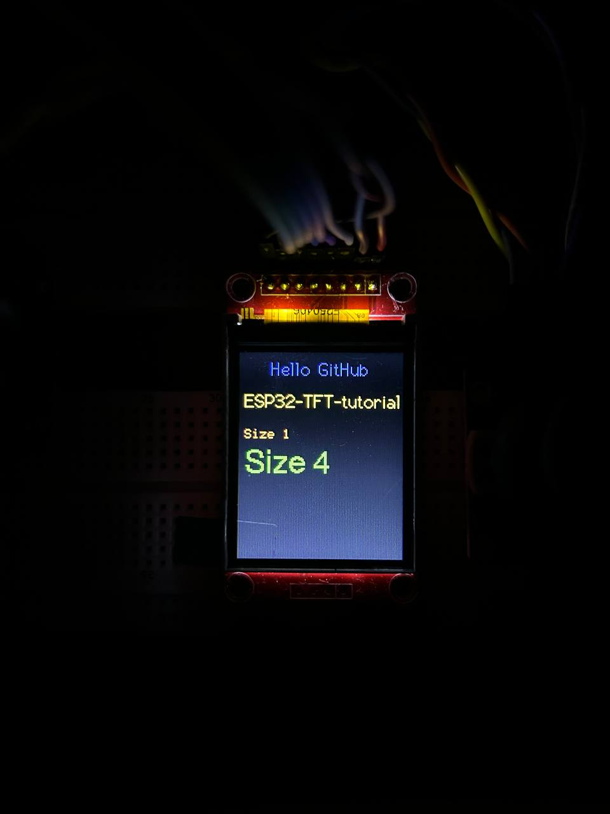

У коді, який я додав у вигляді файлу, є коментарі. Їх також можете переглянути.

---

## 6. Приклади з бібліотеки

У TFT_eSPI є багато готових прикладів:
- простий вивід тексту,
- цифровий і аналоговий годинник,
- графіки,
- малювання картинок.

Вони знаходяться у папці Examples (*TFT_eSPI/examples/160 x 128*). Дуже раджу подивитися приклад з годинником і графіками — це швидко показує можливості бібліотеки.

---

## 7. Особистий досвід

Мій перший серйозний досвід із TFT-дисплеями був у проєкті **метеостанції v1.2**, де я виводив температуру, вологість і стан датчиків.  
👉 [Посилання на метеостанцію](https://github.com/VlaVi21/ESP-NOW_MeteoStation_v1.2) 

---

## 8. Поширені проблеми
- **Дисплей не показує нічого** → перевір живлення (часто треба 3.3V, але є й 5V версії). Також перевір підключення пінів згідно схеми, а також їх вірну ініціалізацію у файлі `User_Setup.h`.
- **Екран білий** → швидше за все, неправильні піни у `User_Setup.h`.
- **Текст "кривий" або кольори не ті** → вкажи правильний чіп контролера дисплею в `User_Setup.h`.  
- **VS Code лається на бібліотеку** → переконайся, що в `platformio.ini` додано `lib_deps = bodmer/TFT_eSPI`. І все відповідає поточній версії бібліотеки.  

---

## Ось і все! Це базовий старт із TFT дисплеєм на ESP32) Дякую за увагу!
